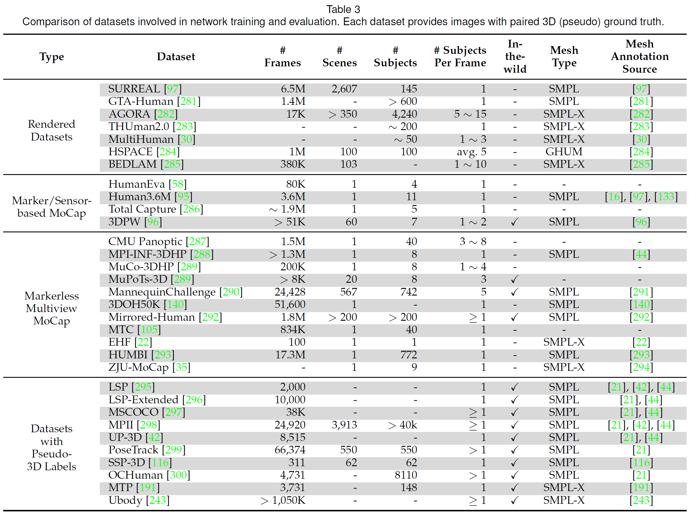
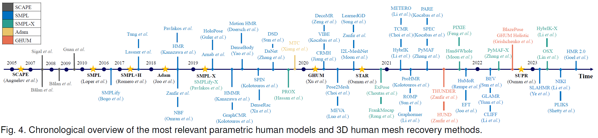
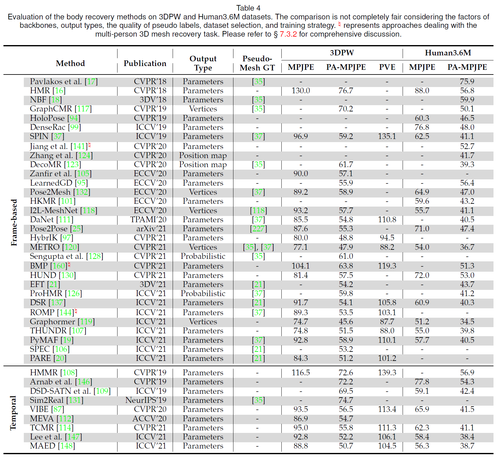

<div align="center">

# Recovering 3D Human Mesh from Monocular Images: A Survey

[Yating Tian](https://github.com/tinatiansjz), [Hongwen Zhang](https://hongwenzhang.github.io), [Yebin Liu](http://www.liuyebin.com), [Limin Wang](https://wanglimin.github.io)

### [Paper](https://arxiv.org/pdf/2203.01923.pdf) | [Abstract](#Abstract) | [Datasets](#datasets) | [Chronological Overview](#overview) | [Benchmarks](#benchmarks)

</div>

## Abstract

Estimating human pose and shape from monocular images is a long-standing problem in computer vision. Since the release of statistical body models, 3D human mesh recovery has been drawing broader attention. With the same goal of obtaining well-aligned and physically plausible mesh results, two paradigms have been developed to overcome challenges in the 2D-to-3D lifting process: i) an optimization-based paradigm, where different data terms and regularization terms are exploited as optimization objectives; and ii) a regression-based paradigm, where deep learning techniques are embraced to solve the problem in an end-to-end fashion. Meanwhile, continuous efforts are devoted to improving the quality of 3D mesh labels for a wide range of datasets. Though remarkable progress has been achieved in the past decade, the task is still challenging due to flexible body motions, diverse appearances, complex environments, and insufficient in-the-wild annotations. To the best of our knowledge, this is the first survey to focus on the task of monocular 3D human mesh recovery. We start with the introduction of body models, and then introduce recovery frameworks and training objectives by providing in-depth analyses of their strengths and weaknesses. We also summarize datasets, evaluation metrics, and benchmark results. Open issues and future directions are discussed in the end, hoping to motivate researchers and facilitate their research in this area. 

This repo will be continuously maintained. Please feel free to create issues if you have any suggestions!

```
Organization of the Survey
├── Introduction
├── Human Modeling
│   ├── Geometric Primitives
│   └── Statistical Modeling
│       ├── Body Modeling
│       └── Whole Body Modeling
├── Human Mesh Recovery
│   ├── Body Recovery
│   │   ├── Optimization-based Paradigm
│   │   └── Regression-based Paradigm
│   │       ├── Output Type
│   │       ├── Intermediate/Proxy Representation
│   │       ├── Supervision
│   │       └── Network Architecture
│   └── Whole Body Recovery with Hands and Face
│       ├── Individual Reconstruction of Hands and Face
│       │   ├── Hands Reconstruction
│       │   └── Face Reconstruction
│       └── Unified Reconstruction
│           ├── Optimization-based Paradigm
│           └── Regression-based Paradigm
├── Multi-person Recovery
├── Recovery from Monocular Videos
├── Physical Plausibility
│   ├── Camera Model
│   ├── Contact Constraint
│   ├── Pose Prior and Shape Prior
│   └── Motion Prior
├── Datasets and Evaluation
│   ├── The Acquisition of Mesh Annotations
│   ├── Datasets
│   │   ├── Rendered Datasets
│   │   ├── Marker/Sensor-based MoCap
│   │   ├── Marker-less Multi-view MoCap
│   │   └── Datasets with Pseudo 3D Labels
│   └── Evaluation
│       ├── Metrics
│       └── Benchmark Leaderboards
└── Conclusion and Future Directions
```

## Datasets

#### Summary of the Datasets

<p align="center">  </p>

## Overview

### Chronological Overview

<p align="center">  </p>

## Benchmarks

<p align="center">  </p>

## Citation

If our survey helps in your research, please consider citing the following paper:

    @article{tian2022hmrsurvey,
      title = {Recovering 3D Human Mesh from Monocular Images: A Survey},
      author = {Tian, Yating and Zhang, Hongwen and Liu, Yebin and Wang, Limin},
      journal = {arXiv preprint arXiv:2203.01923},
      year = {2022},
    }
